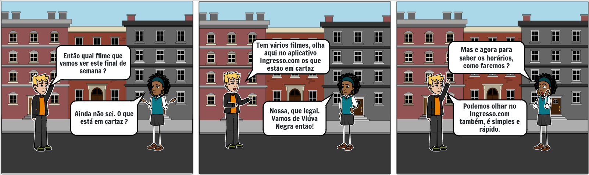
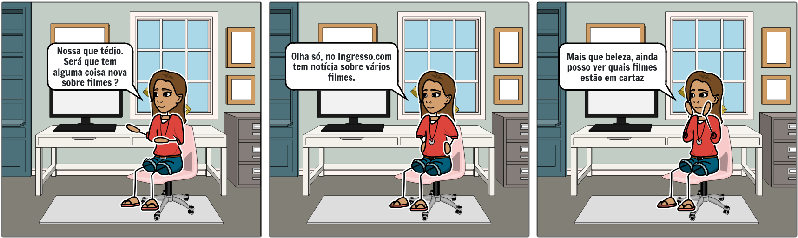
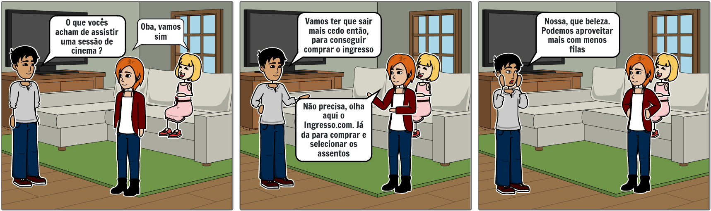

## 1. Versionamento

|Versão|Data|Descrição|Autor(es)|
|------|----|---------|---------|
|1.0|09/08|
Adição do documento de storytelling
|
João Pedro
|
|1.1|09/08|
Adição de tabela de requisitos elicitados
|
João Pedro
|
|1.2|03/10|
Linkagem dos léxicos
|
Thiago
|

## 2. Introdução

<b><i>Storytelling</i></b> é uma técnica de elicitação de requisitos, que traduzida para o português significa Contar Histórias. Estudos demonstram que essa metodologia é capaz de levantar requisitos de uma forma muito eficiente, além, de ser capaz de capturar melhor diversos detalhes específicos. Esse poderio decorre do conhecimento natural do ser humano de contar histórias, para poder se comunicar e compartilhar conhecimento [1]. Por esses e muito outros motivos, essa técnica se faz essencial para a elicitação de requisitos do projeto.

## 3. Resultados
### 3.1 História 1

<h6 align = "center">Figura 1: História 1</h6>
<h6 align = "center">Fonte: Autor, pela ferramenta Storyboard That [2]</h6>

### 3.2 História 2

<h6 align = "center">Figura 2: História 2</h6>
<h6 align = "center">Fonte: Autor, pela ferramenta Storyboard That [2]</h6>

### 3.3 História 3

<h6 align = "center">Figura 3: História 3</h6>
<h6 align = "center">Fonte: Autor, pela ferramenta Storyboard That [2]</h6>

## 4. Requisitos
|ID|Descrição|Tipo de Requisito
|--|--|--|
|ST01|O aplicativo deve ser fácil de ser utilizado|Requisito Não Funcional|
|ST02|O [usuário](../../modelagem/lexicos/#usuario) deve ser capaz de ver os horários das [sessões](../../modelagem/lexicos/#sessao) em um [cinema](../../modelagem/lexicos/#cinema)|Requisito Funcional|
|ST03|O aplicativo deve estar sempre com os horários das [sessões](../../modelagem/lexicos/#sessao) atualizados|Requisito Não Funcional|
|ST04|O [usuário](../../modelagem/lexicos/#usuario) deve ser capaz de acessar uma aba contendo notícias sobre diversos [filmes](../../modelagem/lexicos/#filme)|Requisito Funcional|
|ST05|O aplicativo deve estar sempre com as notícias atualizadas|Requisito Não Funcional|
|ST06|O aplicativo deve ter uma área a visualização dos [filmes](../../modelagem/lexicos/#filme) em cartaz|Requisito Funcional|
|ST07|A lista de [filmes](../../modelagem/lexicos/#filme) e notícias devem ser claras e legíveis|Requisito Não Funcional|
|ST08|O [usuário](../../modelagem/lexicos/#usuario) deve ser capaz de comprar [ingressos](../../modelagem/lexicos/#ingresso)|Requisito Funcional|
|ST09|Na compra de um [ingresso](../../modelagem/lexicos/#ingresso) o [usuário](../../modelagem/lexicos/#usuario) deve possuir a capacidade de escolher seus [assentos](../../modelagem/lexicos/#assento)|Requisito Funcional|
|ST10|O aplicativo deve prover conforto e menos tempos em filas para compra de [ingressos](../../modelagem/lexicos/#ingresso)|Requisito Não Funcional|

## 5. Referências

[1] Boulila, N.; Herrmann A.; Hoffmann A. <b>Using Storytelling to record requirements: Elements for an effective requirements elicitation approach</b>. Fourth International Workshop on Multimedia and Enjoyable Requirements Engineering (MERE'11). IEEE. p. 6-7. 2011.

[2] <b>Storyboard That</b>. Disponível em: <a href="https://www.storyboardthat.com/pt/" target="_blanck">https://www.storyboardthat.com/pt/</a>. Acesso em: 09 de ago. de 2021.

