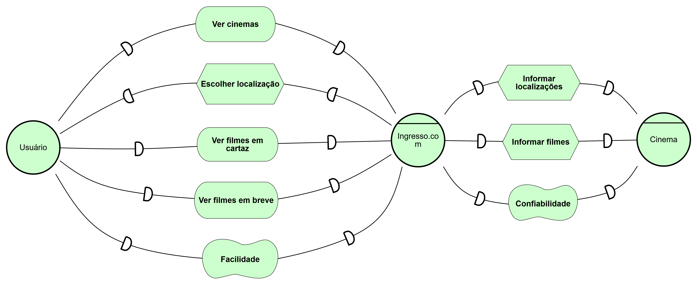
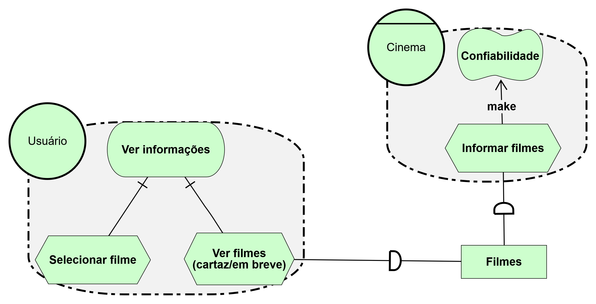
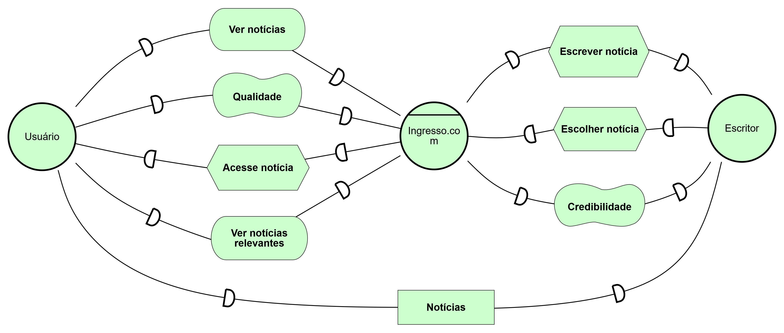
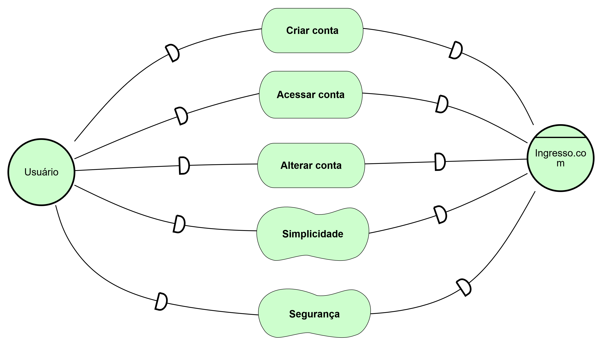
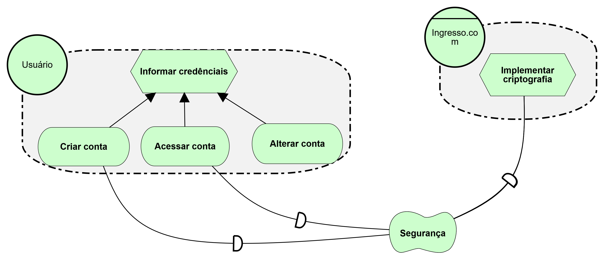
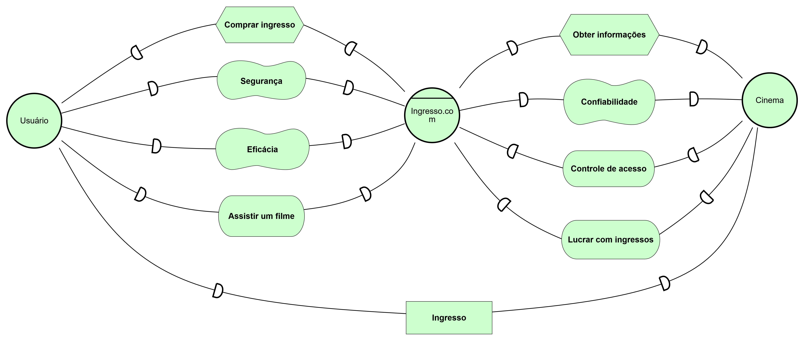
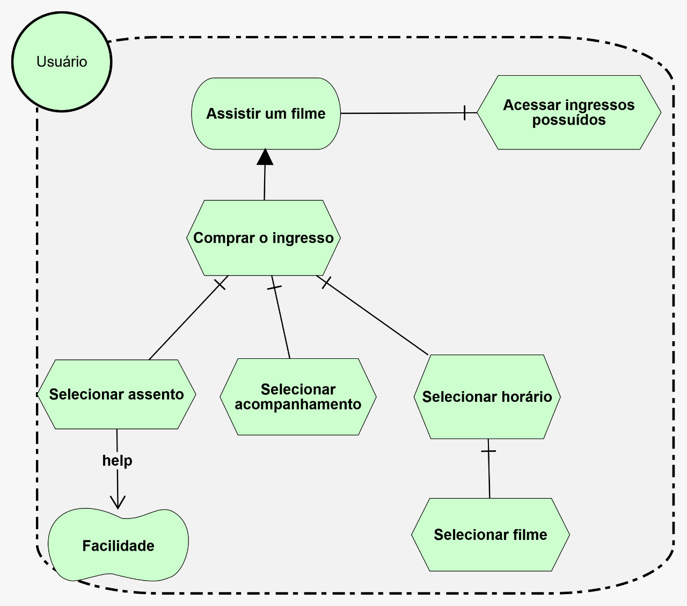

## 1. Versionamento

|Versão|Data|Descrição|Autor(es)|
|------|----|---------|---------|
|1.0|06/09|Criação do documento|João Pedro e Vitor Lamego|
|1.1|06/09|Adição da Introdução|Vitor Lamego|
|1.2|06/09|Adição das imagens|João Pedro|

## 2. Introdução

 A técnica de modelagem iStar se propõe a dar suporte à definição e especificação de elementos que compreenderão o produto final [1]. O iStar é aplicado em diferentes áreas e não somente em Engenharia de Software, trazendo um foco social, estratégico e intencional para a modelagem de determinado contexto. A modelagem traz uma orientação voltada a objetivo e atores para o projeto, sendo dois elementos extremamente focalizados dentro da técnica [2]. Sendo assim, o iStar consegue detalhar e melhorar a visualização de determinado contexto ou de determinado problema em estudo, correlacionando atores, problemas, objetivos e soluções.

 Para o projeto em questão, foram desenvolvidos sete diferentes diagramas no software piStar tool [3] que detalham e analisam diversos contextos da aplicação, sendo eles: Cinema, Notícia, Conta e Ingressos. A seguir podemos analisar cada um desses diagramas envolvendo tanto o Modelo de Dependência quanto o Modelo Rationale para cada contexto.

## 3. iStar

### Cinema
#### Modelo Dependência

<h6 align = "center">Figura 1: Modelo dependência para o cinema.</h6>
<h6 align = "center">Fonte: Autores, pela ferramenta iStar tool [3].</h6>

#### Modelo <i>Rationale</i>

<h6 align = "center">Figura 2: Modelo <i>rationale</i> para o cinema.</h6>
<h6 align = "center">Fonte: Autores, pela ferramenta iStar tool [3].</h6>

### Notícia
#### Modelo Dependência

<h6 align = "center">Figura 3: Modelo dependência para as notícias.</h6>
<h6 align = "center">Fonte: Autores, pela ferramenta iStar tool [3].</h6>

### Conta
#### Modelo Dependência

<h6 align = "center">Figura 4: Modelo dependência para a conta.</h6>
<h6 align = "center">Fonte: Autores, pela ferramenta iStar tool [3].</h6>

#### Modelo <i>Rationale</i>

<h6 align = "center">Figura 5: Modelo <i>rationale</i> para a conta.</h6>
<h6 align = "center">Fonte: Autores, pela ferramenta iStar tool [3].</h6>

### Ingressos
#### Modelo Dependência

<h6 align = "center">Figura 6: Modelo dependência para os ingressos.</h6>
<h6 align = "center">Fonte: Autores, pela ferramenta iStar tool [3].</h6>

#### Modelo <i>Rationale</i>

<h6 align = "center">Figura 7: Modelo <i>rationale</i> para os ingressos.</h6>
<h6 align = "center">Fonte: Autores, pela ferramenta iStar tool [3].</h6>

## 4. Referências

[1] Sanderson. <b>iStar4G: Estendendo a linguagem iStar 2.0 para modelagem de jogos digitais</b>. Disponível em: <a href="http://r1.ufrrj.br/nuesgames/Sanderson.pdf" target="_blank">http://r1.ufrrj.br/nuesgames/Sanderson.pdf</a>. Acesso em: 06 de set. de 2021

[2] iStar Language Guide. Disponível em: <a href="https://sites.google.com/site/istarlanguage/home" target="_blank">iStar Language Guide.</a>. Acesso em: 06 de set. de 2021

[3] piStart tool. Disponível em: <a href="https://www.cin.ufpe.br/~jhcp/pistar/tool/#" target="_blank">https://www.cin.ufpe.br/~jhcp/pistar/tool/#</a>. Acesso em: 03 de set. de 2021

