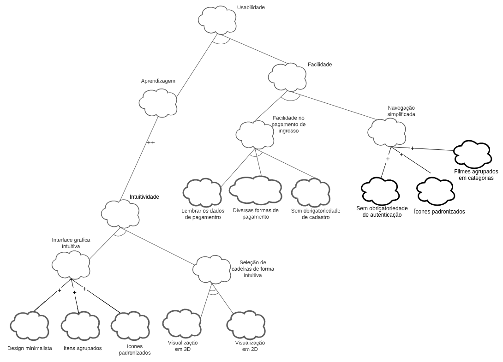
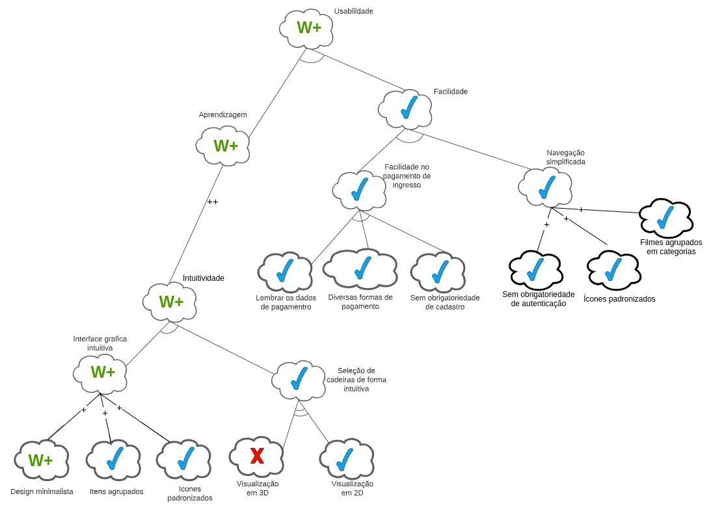
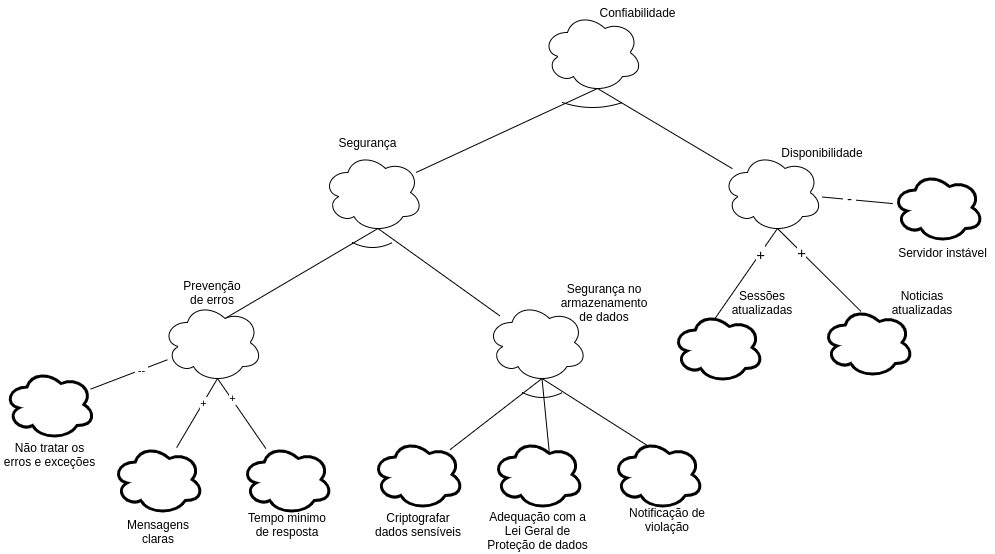
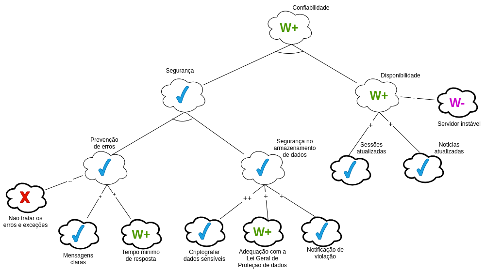
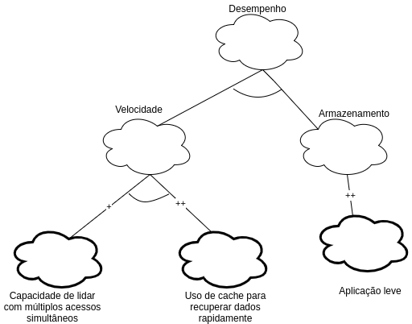
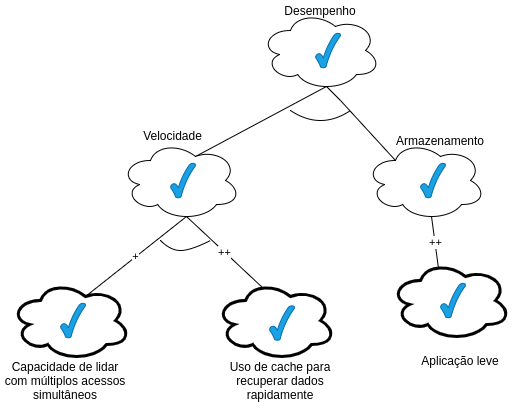
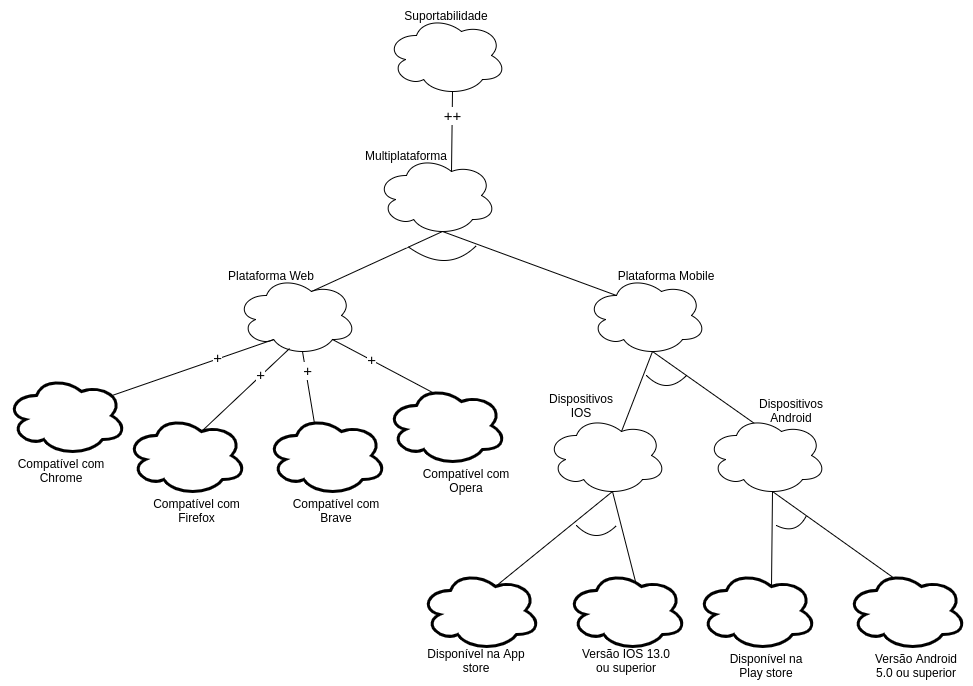
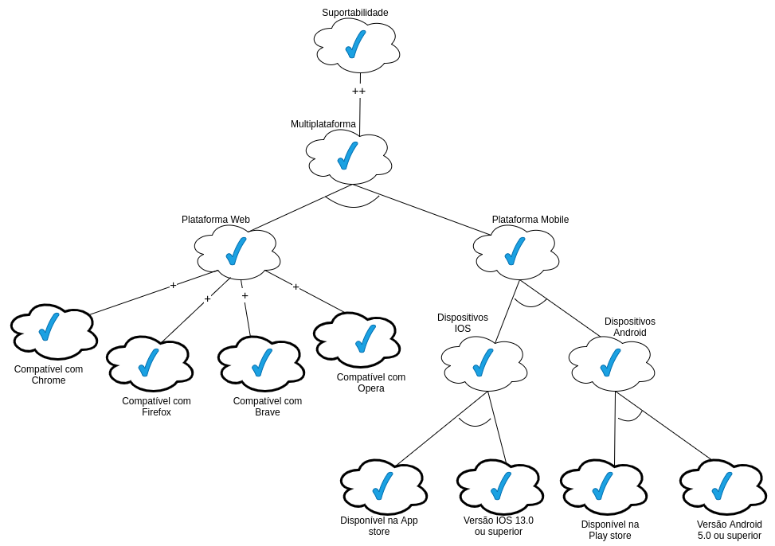

## 1. Versionamento

| Versão | Data  | Descrição                              | Autor(es)       |
| ------ | ----- | -------------------------------------- | --------------- |
| 1.0    | 08/09 | Abertura do documento de NFR Framework | Rafael e Thiago |
| 1.1    | 09/09 | Adição dos gráficos                    | Rafael e Thiago |
| 1.2    | 10/09 | Adição da metodologia                  | Rafael          |

## 2. Introdução

O NFR Framework é uma maneira de se representar e analisar requisitos não-funcionais, ajudando os desenvolvedores na implementação de soluções personalizadas, tomando em consideração os requisitos funcionais, não funcionais, prioridades e carga de trabalho do domínio de um sistema em questão, no caso o do Ingresso.com [1].

A técnica de modelagem acima trata de decompor os requisitos não funcionais a niveis operacionais, facilitando a compreensão, priorização e garantindo que as expectativas dos stakeholders sejam atendidas.

## 3. Metodologia

Cada tema de diagrama NFR elaborado nesse documento foi retirado dos requisitos não funcionais levantados na <a href="https://requisitos-de-software.github.io/2021.1-Ingresso.com/modelagem/especificacao/">especificação suplementar</a>. Também foram identificados novos requisitos não funcionais ou operacionalizações (requisitos funcionais) que não tinham sido elicitadas em nenhum momento anterior. 

Os tipos de contribuição utilizados nos diagramas foram [1]: 

* **AND**: Caso os softgoals descendentes sejam satisfeitos, serão também os ascendentes.
* **OR**: Caso algum softgoal descendentes seja satisfeitos, será também os ascendente.
* **MAKE (++)**: Caso o softgoal descendente for suficientemente satisfeito, será também o
ascendente, porém, a contribuição é fornecida como suficientemente positiva concebida no
nível mais alto de satisfação.
* **HELP (+)**: Caso o softgoal descendente seja parcialmente satisfeito, será parcialmente
satisfeito o ascendente.
* **HURT (-)**: Caso o softgoal descendente seja satisfeito, o softgoal ascendente será
parcialmente negado.

Os rótulos utilizados foram:

*  Satisfeito.
*  Negado.
*  Fracamente satisfeito. 
*  Fracamente negado.

## 4. Gráfico de Interdependência de Softgoal

### 4.1 Usabilidade

<h6 align = "center">Figura 1: SIG de usabilidade</h6>
<h6 align = "center">Fonte: Autores</h6>

### 4.2 Usabilidade com propagação

<h6 align = "center">Figura 2: SIG de usabilidade com propagaçao</h6>
<h6 align = "center">Fonte: Autores</h6>

### 4.4 Confiabilidade

<h6 align = "center">Figura 3: SIG de confiabilidade</h6>
<h6 align = "center">Fonte: Autores</h6>

### 4.4 Confiabilidade com propagação

<h6 align = "center">Figura 4: SIG de confiabilidade com propagação</h6>
<h6 align = "center">Fonte: Autores</h6>

### 4.5 Desempenho

<h6 align = "center">Figura 5: SIG de desempenho</h6>
<h6 align = "center">Fonte: Autores</h6>

### 4.6 Desempenho com propagação

<h6 align = "center">Figura 6: SIG de desempenho com propagação</h6>
<h6 align = "center">Fonte: Autores</h6>

### 4.7 Suportabilidade

<h6 align = "center">Figura 7: SIG de suportabilidade</h6>
<h6 align = "center">Fonte: Autores</h6>

### 4.8 Suportabilidade com propagação

<h6 align = "center">Figura 8: SIG de suportabilidade com propagação</h6>
<h6 align = "center">Fonte: Autores</h6>

## 5. Referências 

[1] SILVA, Reinaldo Antônio da. <b>NFR4ES:Um Catálogo de Requisitos Não-Funcionais para Sistemas Embarcados</b>. Recife, 2019
