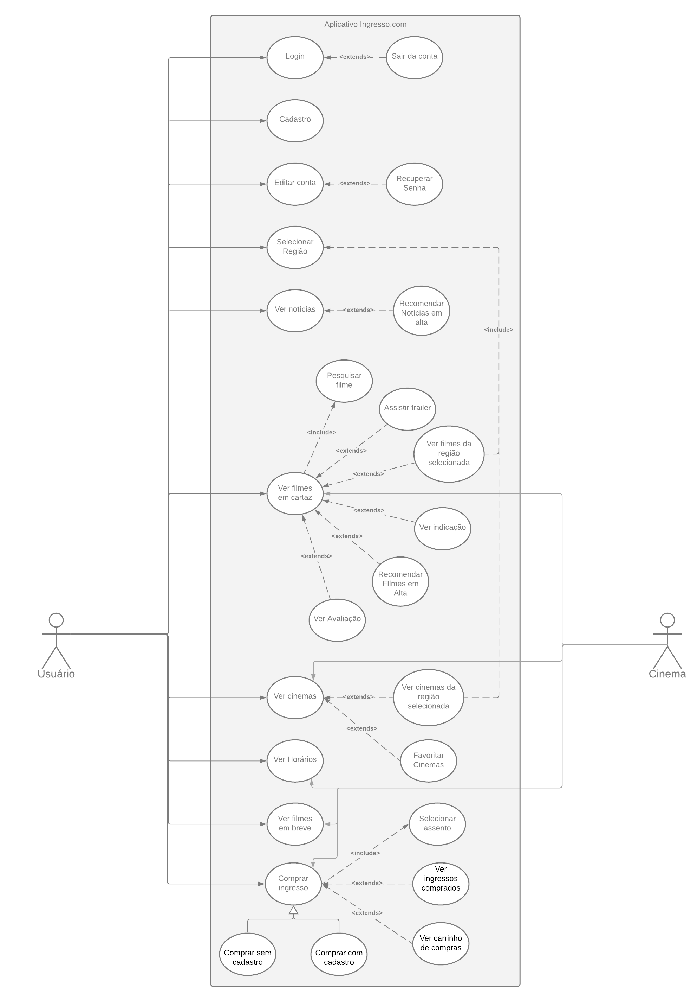

## 1. Versionamento

|Versão|Data|Descrição|Autor(es)|
|------|----|---------|---------|
|1.0|23/08|Criação do documento|João Pedro e Victor Lima|
|1.1|23/08|Adição da introdução e do Diagrama de Casos de Uso|João Pedro e Victor Lima|
|1.2|24/08|Adição das tabelas 6 a 10 de especialização|João Pedro|
|1.3|25/08|Adição das tabelas 1 a 5 de especialização|Victor Lima|
|1.4|01/10|Linkagem dos léxicos|João Pedro|

## 2. Introdução

 Diversas são as formas de se modelar os requisitos elicitados de um sistema. Entre essas diversas maneiras se encontra a técnica de <b>Casos de Uso</b>, utilizada especificamente para os requisitos funcionais do software. Nesse diagrama, segundo Andrey	(2007, pág. 15)[1], são representados um conjunto de ações que um <a href=../../modelagem/lexicos/#usuario>usuário</a> pode realizar em um sistema, bem como, relacionamentos entre ator e caso de uso, e entre caso de uso e caso de uso.

 Entretanto, apenas a utilização do diagrama pode deixar pontos em aberto, por isso, em conjunto com essa metodologia, se faz a utilização da <b>Especialização dos Casos de Uso</b>. Nessa especialização, ainda conforme Andrey [1], o diagrama de casos de uso será complementado buscando descrever os comportamentos dos casos de uso.

## 3. Diagrama de Casos de Uso

<h6 align = "center">Figura 1: Casos de Uso do aplicativo Ingresso.com.</h6>
<h6 align = "center">Fonte: Autores</h6>

## 4. Especificação dos Casos de Uso
### UC01 Login

|UC01|Informações|
|--|--|
|Descrição| O [usuário](../../modelagem/lexicos/#usuario) deve poder fazer login no app|
|Ator| [Usuário](../../modelagem/lexicos/#usuario)|
|Pré-condições| Acesso à internet e Ter uma conta|
|Ação| O [usuário](../../modelagem/lexicos/#usuario) entrar na sua conta|
|Fluxo Principal|<b>FP01</b>: Fluxo de fazer login no aplicativo 1. O ator entra no aplicativo 2. O sistema exibe 5 funcionalidades pricipais de acesso 3. O ator clica no ícone de perfil no canto superior direito 4. O sistema mostra a opção entrar 5. O ator digita suas informações de login|
|Pós-condições| O ator poderá ter acesso as funcionalidades de [usuário](../../modelagem/lexicos/#usuario) logado|

<h6 align = "center">Tabela 1: Tabela de especialização do login.</h6>
<h6 align = "center">Fonte: Autores</h6>

### UC02 Cadastro 

|UC02|Informações|
|--|--|
|Descrição| O [usuário](../../modelagem/lexicos/#usuario) deve poder se cadastrar no aplicativo|
|Ator| [Usuário](../../modelagem/lexicos/#usuario)|
|Pré-condições| Acesso à internet|
|Ação| O [usuário](../../modelagem/lexicos/#usuario) se cadastrar na plataforma|
|Fluxo Principal|<b>FP01</b>: Fluxo de fazer cadastro no aplicativo 1. O ator entra no aplicativo 2. O sistema exibe 5 funcionalidades pricipais de acesso 3. O ator clica no ícone de perfil no canto superior direito 4. O sistema mostra a opção entrar 5. O ator clica em criar conta 6. O ator digita suas informações e se cadastra|
|Fluxo Alternativo|<b>FA01</b>: Fluxo de fazer cadastro no aplicativo 1. O ator entra no aplicativo 2. O sistema exibe 5 funcionalidades principais de acesso 3. O ator clica no ícone de perfil no canto superior direito 4. O sistema mostra a opção de entrar 5. O ator clica em continuar com o Facebook  <b>FA02</b>: Fluxo de fazer cadastro no aplicativo 1. O ator entra no aplicativo 2. O sistema exibe 5 funcionalidades principais de acesso 3. O ator clica no ícone de perfil no canto superior direito 4. O sistema mostra a opção de entrar 5. O ator clica em continuar com o Google |
|Pós-condições|O ator poderá fazer login no aplicativo|

<h6 align = "center">Tabela 2: Tabela de especialização do cadastro.</h6>
<h6 align = "center">Fonte: Autores</h6>

### UC03 Editar Conta 

|UC03|Informações|
|--|--|
|Descrição| O [usuário](../../modelagem/lexicos/#usuario) deve poder editar seu perfil|
|Ator| [Usuário](../../modelagem/lexicos/#usuario)|
|Pré-condições| Acesso à internet e ter uma conta no aplicativo|
|Ação| Edição do perfil do [Usuário](../../modelagem/lexicos/#usuario)|
|Fluxo Principal|<b>FP01</b>: Fluxo de editar a conta no app 1. O ator entra no aplicativo 2. O sistema exibe 5 funcionalidades pricipais de acesso 3. O ator clica no ícone de perfil no canto superior direito 4. O sistema mostra a opção entrar 5. O ator digita suas informações de login 6. O ator clica em dados pessoais 7. O ator edita suas informações para as novas|
|Fluxo Alternativo|<b>FA01</b>: Fluxo de editar conta no app 1. O ator entra no aplicativo com suas informações de login salvas 2. O sistema exibe 5 funcionalidades pricipais de acesso 3. O ator clica no ícone de perfil no canto superior direito 4. O ator clica em dados pessoais 5. O ator edita suas informações para as novas|
|Pós-condições| O [Usuário](../../modelagem/lexicos/#usuario) mantém suas informações atualizadas|

<h6 align = "center">Tabela 3: Tabela de especialização de editar a conta.</h6>
<h6 align = "center">Fonte: Autores</h6>

### UC04 Selecionar Região 

|UC04|Informações|
|--|--|
|Descrição| O [usuário](../../modelagem/lexicos/#usuario) deve poder trocar a região em que ele se encontra para ver filme|
|Ator| [Usuário](../../modelagem/lexicos/#usuario)|
|Pré-condições| Acesso à internet|
|Ação| Trocar a Região do aplicativo para verificar as [sessões](../../modelagem/lexicos/#sessao)|
|Fluxo Principal|<b>FP01</b>: Fluxo para trocar região 1. O ator entra no aplicativo 2. O sistema exibe 5 funcionalidades pricipais de acesso 3. O ator clica na região selecionada no canto superior esquerdo 4. O sistema mostra a região selecionada 5. O [usuário](../../modelagem/lexicos/#usuario) escolhe outra região|
|Fluxo Alternativo|<b>FP01</b>: Fluxo para trocar região 1. O ator entra no aplicativo 2. O sistema exibe 5 funcionalidades pricipais de acesso 3. O ator clica no ícone de perfil no canto superior direito 4. O sistema mostra a região selecionada 5. O [usuário](../../modelagem/lexicos/#usuario) clica em cima da região atual 6. O [usuário](../../modelagem/lexicos/#usuario) escolhe outra região|
|Pós-condições| O [usuário](../../modelagem/lexicos/#usuario) pode verificar os filmes em qualquer local que desejar|

<h6 align = "center">Tabela 4: Tabela de especialização de selecionar a região.</h6>
<h6 align = "center">Fonte: Autores</h6>

### UC05 Ver [Notícias](../../modelagem/lexicos/#noticia)

|UC05|Informações|
|--|--|
|Descrição| O [Usuário](../../modelagem/lexicos/#usuario) deve poder ver [Notícias](../../modelagem/lexicos/#noticia) relacionadas aos filmes e [cinema](../../modelagem/lexicos/#cinema)|
|Ator| [Usuário](../../modelagem/lexicos/#usuario)|
|Pré-condições| Acesso à internet|
|Ação| Ir até a aba de [notícias](../../modelagem/lexicos/#noticia)|
|Fluxo Principal|<b>FP01</b>: Fluxo de acessar [notícias](../../modelagem/lexicos/#noticia) pelo menu inferior 1. O ator entra no aplicativo 2. O sistema exibe 5 funcionalidades pricipais de acesso 3. O ator clica em "[Notícias](../../modelagem/lexicos/#noticia)" 4. O sistema mostra as [notícias](../../modelagem/lexicos/#noticia) disponíveis|
|Fluxo Alternativo|<b>FA01</b>: Fluxo de acessar [notícias](../../modelagem/lexicos/#noticia) pela página de destaques 1. O ator entra no aplicativo 2. O sistema exibe 5 funcionalidades pricipais de acesso 3. O ator clica em [Notícias](../../modelagem/lexicos/#noticia) em alta em destaques 4. O sistema mostra as [notícias](../../modelagem/lexicos/#noticia) disponíveis|
|Pós-condições| O ator consegue vizualizar todas as atualizações sobre os filmes |

<h6 align = "center">Tabela 5: Tabela de especialização da visualização de <a href=../../modelagem/lexicos/#noticia>notícia</a>.</h6>
<h6 align = "center">Fonte: Autores</h6>

### UC06 Ver Filmes em Cartaz

|UC06|Informações|
|--|--|
|Descrição|O [usuário](../../modelagem/lexicos/#usuario) deve visualizar os filmes em cartaz|
|Ator|[Usuário](../../modelagem/lexicos/#usuario)|
|Pré-condições|Acesso à internet|
|Ação|O [usuário](../../modelagem/lexicos/#usuario) ver os filmes em cartaz|
|Fluxo Principal|<b>FP01</b>: Fluxo de acessar filmes em cartaz pelo menu inferior 1. O ator entra no aplicativo 2. O sistema exibe 5 funcionalidades pricipais de acesso 3. O ator clica em "Filmes" 4. O sistema mostra a opção "Em Cartaz" ou "Em Breve" 5. O ator seleciona a opção "Em Cartaz"|
|Fluxo Alternativo|<b>FA01</b>: Fluxo de acessar filmes em alta no menu principal 1. O ator entra no aplicativo 2. O sistema exibe no menu principal os filmes em alta 3. O ator seleciona essa opção 4. O ator é redirecionado para a aba de filmes em cartaz  <b>FA02</b>: Fluxo de acessar filmes pela pesquisa 1. O ator entra no aplicativo 2. O ator clica em filmes na navegação 3. O ator seleciona a lupa 4. O ator pesquisa o filme|
|Pós-condições|O ator poderá visualizar todos os filmes em cartaz em sua região|

<h6 align = "center">Tabela 6: Tabela de especialização da visualização dos filmes em cartaz.</h6>
<h6 align = "center">Fonte: Autores</h6>

### UC07 Ver [cinemas](../../modelagem/lexicos/#cinema)

|UC07|Informações|
|--|--|
|Descrição|O [usuário](../../modelagem/lexicos/#usuario) deve visualizar os [cinemas](../../modelagem/lexicos/#cinema) em sua região|
|Ator|[Usuário](../../modelagem/lexicos/#usuario)|
|Pré-condições|Acesso à internet e acesso à [localização](../../modelagem/lexicos/#local)|
|Ação|O [usuário](../../modelagem/lexicos/#usuario) ver os [cinemas](../../modelagem/lexicos/#cinema)|
|Fluxo Principal|<b>FP01</b>: Fluxo de acessar [cinemas](../../modelagem/lexicos/#cinema) pelo menu inferior 1. O ator entra no aplicativo 2. O sistema exibe 5 funcionalidades pricipais de acesso 3. O ator clica em "[Cinemas](../../modelagem/lexicos/#cinema)" 4. O ator seleciona o [cinema](../../modelagem/lexicos/#cinema) de sua escolha|
|Fluxo Alternativo|<b>FA01</b>: Fluxo de acessar um [cinema](../../modelagem/lexicos/#cinema) pelo filme em cartaz 1. O ator entra no aplicativo 2. O ator acessa a funcionalidade "Filmes" 3. O ator escolhe a opção "Em Cartaz" 4. O ator seleciona um filme de sua escolha 5. O sistema exibe informações de [sessões](../../modelagem/lexicos/#sessao) em diversos [cinemas](../../modelagem/lexicos/#cinema) 6. O ator seleciona um [cinema](../../modelagem/lexicos/#cinema) de sua escolha  <b>FA02</b>: Fluxo de acessar um [cinema](../../modelagem/lexicos/#cinema) pelo menu principal 1. O ator entra no aplicativo 2. O sistema exibe em seu menu principal a opção "[Cinemas](../../modelagem/lexicos/#cinema) Abertos Próximos de Você" 3. O [usuário](../../modelagem/lexicos/#usuario) seleciona essa opção 4. O sistema redireciona para a aba "[Cinemas](../../modelagem/lexicos/#cinema)"  <b>FA03</b>: Fluxo de acessar um [cinema](../../modelagem/lexicos/#cinema) pela pesquisa 1. O ator entra no aplicativo 2. O ator clica em [cinemas](../../modelagem/lexicos/#cinema) na barra de navegação 3. O ator clica na lupa de pesquisa 4. O sistema mostra os [cinemas](../../modelagem/lexicos/#cinema) que tenham conexão com a pesquisa|
|Pós-condições|O ator poderá visualizar informações do [cinema](../../modelagem/lexicos/#cinema), bem como, [cinemas](../../modelagem/lexicos/#cinema) em sua região|

<h6 align = "center">Tabela 7: Tabela de especialização da visualização dos <a href=../../modelagem/lexicos/#cinema>cinemas</a>.</h6>
<h6 align = "center">Fonte: Autores</h6>

### UC08 Ver Horários

|UC08|Informações|
|--|--|
|Descrição|O [usuário](../../modelagem/lexicos/#usuario) deve visualizar os horários de uma [sessão](../../modelagem/lexicos/#sessao)|
|Ator|[Usuário](../../modelagem/lexicos/#usuario)|
|Pré-condições|Acesso à internet|
|Ação|O [usuário](../../modelagem/lexicos/#usuario) ver os horários das [sessões](../../modelagem/lexicos/#sessao)|
|Fluxo Principal|<b>FP01</b>: Fluxo de acessar os horários pelo filme escolhido 1. O ator entra no aplicativo 2. O ator acessa a funcionalidade "Filmes" 3. O ator escolhe a opção "Em Cartaz" 4. O ator seleciona um filme de sua escolha 5. O sistema mostra todas as [sessões](../../modelagem/lexicos/#sessao) dos [cinemas](../../modelagem/lexicos/#cinema) com seus horários|
|Fluxo Alternativo|<b>FA01</b>: Fluxo de acessar os horários pelas [sessões](../../modelagem/lexicos/#sessao) de um [cinema](../../modelagem/lexicos/#cinema)  O ator entra no aplicativo 2. O ator acessa a funcionalidade "[Cinemas](../../modelagem/lexicos/#cinema)" 3. O ator escolhe um [cinema](../../modelagem/lexicos/#cinema) 4. O sistema mostra os filmes em cartaz daquele sistema 5. O [usuário](../../modelagem/lexicos/#usuario) seleciona um filme de sua escolha 6. O aplicativo retorna os horários das [sessões](../../modelagem/lexicos/#sessao) para aquele filme e [cinema](../../modelagem/lexicos/#cinema) selecionados|
|Pós-condições|O ator poderá ver os horários das [sessões](../../modelagem/lexicos/#sessao) do filme em um [cinema](../../modelagem/lexicos/#cinema) escolhido|

<h6 align = "center">Tabela 8: Tabela de especialização da visualização dos horários.</h6>
<h6 align = "center">Fonte: Autores</h6>

### UC09 Ver Filmes em Breve

|UC09|Informações|
|--|--|
|Descrição|O [usuário](../../modelagem/lexicos/#usuario) deve visualizar os filmes em breve|
|Ator|[Usuário](../../modelagem/lexicos/#usuario)|
|Pré-condições|Acesso à internet|
|Ação|O [usuário](../../modelagem/lexicos/#usuario) ver os filmes em breve|
|Fluxo Principal|<b>FP01</b>: Fluxo de acessar filmes em breve pelo menu inferior 1. O ator entra no aplicativo 2. O sistema exibe 5 funcionalidades pricipais de acesso 3. O ator clica em "Filmes" 4. O sistema mostra a opção "Em Cartaz" ou "Em Breve" 5. O ator seleciona a opção "Em Breve"|
|Fluxo Alternativo|<b>FA01</b>: Fluxo de acessar filmes em breve no menu principal 1. O ator entra no aplicativo 2. O sistema exibe no menu principal os filmes em breve 3. O ator seleciona essa opção 4. O ator é redirecionado para a aba de filmes em breve|
|Pós-condições|O ator poderá visualizar todos os filmes em breve, com suas datas de lançamento|

<h6 align = "center">Tabela 9: Tabela de especialização da visualização dos filmes em breve.</h6>
<h6 align = "center">Fonte: Autores</h6>

### UC10 Comprar Ingresso

|UC10|Informações|
|--|--|
|Descrição|O [usuário](../../modelagem/lexicos/#usuario) deve conseguir realizar a compra de um ou mais [ingressos](../../modelagem/lexicos/#ingresso)|
|Ator|[Usuário](../../modelagem/lexicos/#usuario)|
|Pré-condições|Acesso à internet|
|Ação|O [usuário](../../modelagem/lexicos/#usuario) comprar os [ingressos](../../modelagem/lexicos/#ingresso)|
|Fluxo Principal|<b>FP01</b>: Fluxo de comprar [ingressos](../../modelagem/lexicos/#ingresso) selecionando o horário do filme 1. O ator entra no aplicativo 2. O ator acessa a funcionalidade "Filmes" 3. O ator seleciona a opção "Em Cartaz" 4. O ator seleciona um filme de sua escolha 5. O ator seleciona o [cinema](../../modelagem/lexicos/#cinema) de sua escolha 6. O ator seleciona o horário de sua escolha 7. O ator seleciona seus [assentos](../../modelagem/lexicos/#assento) da [sessão](../../modelagem/lexicos/#sessao) 8. O ator seleciona o tipo de [ingresso<](../../modelagem/lexicos/#ingresso)br/>9. O ator seleciona a forma de pagamento|
|Pós-condições|O ator terá acesso aos seus [ingressos](../../modelagem/lexicos/#ingresso) comprados|

<h6 align = "center">Tabela 10: Tabela de especialização da compra de <a href=../../modelagem/lexicos/#ingresso>ingressos</a>.</h6>
<h6 align = "center">Fonte: Autores</h6>

## 5. Referências

[1] Andrey, R. P. <b>Projeto de Software Usando a UML</b>. 2007.

