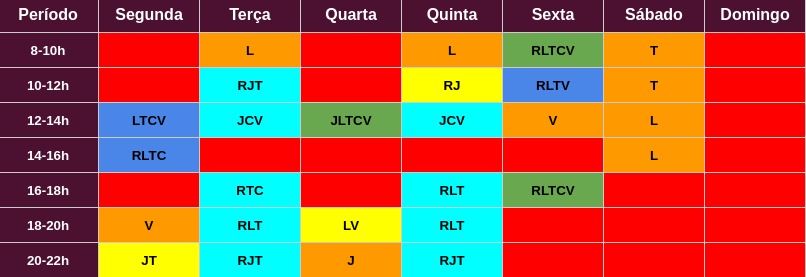
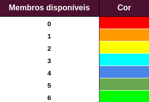
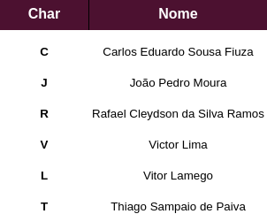

## 1. Versionamento

|Versão|Data|Descrição|Autor(es)|
|------|----|---------|---------|
|1.0|27/07|<center>Adição do cronograma de etapas e ferramentas</center>|<center>Rafael e Thiago</center>|
|1.1|29/07|<center>Adição das Metodologias</center>|<center>Carlos Eduardo e Vitor Lamego</center>|
|1.2|31/07|<center>Adição do HeatMap</center>|<center>Rafael</center>|
|1.3|04/08|<center>Adição referências e legendas</center>|<center>João Pedro, Vitor Lamego</center>|
|1.4|04/08|<center>Adição nova ferramenta de storyboard</center>|<center>João Pedro</center>|
|2.0|24/08|<center>Melhoria do Cronograma</center>|<center>João Pedro</center>|
|2.1|24/08|<center>Adição de datas no Cronograma</center>|<center>João Pedro</center>|
|3.0|10/09|<center>Adição de datas no Cronograma (4 entrega)</center>|<center>João Pedro</center>|
|4.0|19/09|<center>Adição de datas no Cronograma (5 entrega)</center>|<center>João Pedro</center>|
|5.0|09/10|<center>Adição de datas no Cronograma (6 entrega)</center>|<center>João Pedro</center>|

## 2. Cronograma

<p style="text-align: justify; text-indent: 20px">O cronograma das etapas do projeto foi baseado nas datas de entregas das atividades descritas no plano de ensino da disciplina de Requisitos de Software, visando atender às exigências de cada ponto de controle. As datas podem ser alteradas, caso haja necessidade.</p>

#### 2.1 Etapa Escrita Geral (Desenvolvimento da documentação)

| Título                         | Data        |Descrição|
| :------------------------------: | ----------- | -------------------------------------------------------------------------- |
I - Pré-Rastreabilidade            | 27/07 - 04/08 | Planejamento do Projeto, Rich Picture|
II - Elicitação de Requisitos       | 05/08 - 21/08 | Técnicas e Priorização|
III - Modelagem de Requisitos        | 22/08 - 30/08 | Cenários, Léxico, Use Case, Especificação Suplementar|
IV - Modelagem de Requisitos (Ágil)| 31/08 - 11/09 | Histórias de Usuário, Backlogs, NFR Framework|
V - Análise de Requisitos          | 12/09 - 18/09 | Análise de requisitos: Verificação e Validação  |
VI - Pós-Rastreabilidade            | 19/09 - 09/10 | Gerência de Desenvolvimento de Software orientada à baseline de Requisitos |
<h6 align = "center">Tabela 1: Tabela geral contendo datas e descrições sobre as etapas de desenvolvimento</h6>
<h6 align = "center">Fonte: Autor</h6>

#### 2.2 Etapa Escrita Específica (Issues, Responsáveis e Revisores)

|Tema|Título|Data de Entrega|Responsáveis|Revisores|
|:-:|:-:|:-:|:-:|:-:|
|||<b>Primeira Entrega</b>|||
|I. Pré-Rastreabilidade|Cronograma e Ferramentas|05/07|Rafael e Thiago|Carlos e João Pedro|
|I. Pré-Rastreabilidade|Documento de Metodologia|01/08|Carlos e Vitor Lamego|Rafael e Thiago
|I. Pré-Rastreabilidade|Pré-Elicitação Rich Picture|01/08|João Pedro e Victor Lima|Carlos e Thiago|
|||<b>Segunda Entrega</b>|||
|II. Elicitação de Requisitos|Documento de Atas|06/08|João Pedro|Rafael|
|II. Elicitação de Requisitos|Justificativa de Escolha|10/08|Vitor Lamego|João Pedro e Thiago|
|II. Elicitação de Requisitos|Elicitação Personas|10/08|João Pedro|Carlos e Vitor Lamego|
|II. Elicitação de Requisitos|Elicitação Análise de Protocolo|11/08|Rafael|Carlos e João Pedro|
|II. Elicitação de Requisitos|Elicitação Storytelling|12/08|João Pedro|Rafael e Victor Lima|
|II. Elicitação de Requisitos|Elicitação Observação Participativa|16/08|Carlos|João Pedro e Victor Lima|
|II. Elicitação de Requisitos|Elicitação Brainstorming|20/08|Rafael, Thiago e Vitor Lamego|João Pedro e Victor Lima
|II. Elicitação de Requisitos|Elitação Questionário|20/08|Victor Lima|Carlos e João Pedro
|II. Pré-Rastreabilidade|Pré-Elicitação 5W2H|15/08|Vitor Lamego|Rafael e Victor Lima|
|II. Priorização de Requisitos|Priorização MoSCoW|21/08|Victor Lima e Vitor Lamego|Carlos e Thiago|
|II. Priorização de Requisitos|Priorização House of Quality|22/08|João Pedro e Rafael|Victor Lima e Vitor Lamego|
|II. Priorização de Requisitos|First Things First|23/08|Carlos e Thiago|João Pedro e Rafael|
|||<b>Terceira Entrega</b>|||
|III. Modelagem de Requisitos|Modelagem Léxicos|27/08|Rafael e Thiago|Carlos e João|
|III. Modelagem de Requisitos|Modelagem Especificação Suplementar|27/08|Rafael e Thiago|Carlos e João|
|III. Modelagem de Requisitos|Modelagem Use Case|27/08|João Pedro e Victor Lima|Rafael e Vitor Lamego|
|III. Modelagem de Requisitos|Modelagem Cenários|28/08|Carlos e Vitor Lamego|Thiago e Victor Lima|
|||<b>Quarta Entrega</b>|||
|IV. Modelagem Ágil de Requisitos|Modelagem Ágil iStar|02/09|João e Vitor Lamego|Thiago e Rafael|
|IV. Modelagem Ágil de Requisitos|Modelagem Ágil NFR <i>Framework</i>|10/09|Thiago e Rafael|Carlos e João|
|IV. Modelagem Ágil de Requisitos|Modelagem Ágil Product Backlog e Histórias de Usuário|11/09|Carlos e Victor Lima|João e Vitor Lamego|
|||<b>Quinta Entrega</b>|||
|V. Verificação e Validação|Verificação iStar|14/09|João|Rafael|
|V. Verificação e Validação|Verificação Product Backlog|15/09|Carlos|João e Thiago|
|V. Verificação e Validação|Verificação Casos de Uso|15/09|Carlos|Vitor Lamego|
|V. Verificação e Validação|Verificação NFR Framework|16/09|Thiago|João|
|V. Verificação e Validação|Verificação Léxicos|16/09|Rafael|Carlos|
|V. Verificação e Validação|Verificação Cenários|16/09|Vitor Lamego|Thiago|
|V. Verificação e Validação|Verificação Rich Picture|19/09|Victor Lima|João e Thiago|
|V. Verificação e Validação|Validação Viewpoint|20/09|João e Thiago|Rafael e Victor Lima|
|V. Verificação e Validação|Validação Protótipo|20/09|Rafael e Victor Lima|Carlos e Thiago
|V. Verificação e Validação|Validação Informal|20/09|Vitor Lamego|Victor Lima e Carlos|
|||<b>Sexta Entrega</b>|||
|VI. Pós-Rastreabilidade|Backward From|08/09|João Pedro, Vitor Lamego e Victor Lima|Carlos, Thiago e Rafael
|VI. Pós-Rastreabilidade|Foward From|08/09|Carlos, Thiago e Rafael|VJoão Pedro, Vitor Lamego e Victor Lima|
<h6 align = "center">Tabela 2: Tabela específica contendo data de entrega, responsáveis e revisores</h6>
<h6 align = "center">Fonte: Autor</h6>

#### 2.3 Etapa de Gravação (Desenvolvimento das apresentações)

| Título             | Data        |Descrição|
| :-------------------------------: |-------------|---------|
Apresentação I                   |04/08        |Apresentação da equipe, Definição do APP e Planejamento do Projeto, RichPicture|
Apresentação II                  |23/08        |Elicitação – Técnicas e Priorização|
Apresentação III                 |01/09        |Modelagem de Requisitos: Cenários , Léxico, Use Case, Especificação Suplementar|
Apresentação IV                  |20/09        |Modelagem de Requisitos - Ágil (US, Backlogs, NFR Framework)|
Apresentação V                   |22/09        |Análise de Requisitos: Verificação e Validação|
Apresentação VI                  |13/10        |Pós-Rastreabilidade - Gerência II|
<h6 align = "center">Tabela 3: Tabela contendo datas e descrições sobre as etapas de gravação</h6>
<h6 align = "center">Fonte: Autor</h6>

## 3. Metodologia

### 3.1 Extreme Programming (XP)

<p style="text-align: justify; text-indent: 20px">Apesar do projeto não trabalhar efetivamente com programação de um software e sim com a parte de documentação, com foco na área de requisitos, o grupo optou por utilizar esta metodologia ágil devido aos seus cinco principais valores, que se encaixam muito bem no contexto deste projeto, sendo eles: <b>Comunicação</b>, <b>Simplicidade</b>, <b>Feedback</b>, <b>Coragem</b> e <b>Respeito</b> [1].</p>

<p style="text-align: justify; text-indent: 20px">Além disso, por ser uma metodologia ágil fortemente ligada a respostas rápidas às mudanças, o grupo terá reuniões semanais para discutir novas issues para o projeto, assim como passar o feedback do que foi feito até o estágio atual. Esta parte de reuniões é inspirada também na metodologia SCRUM, sendo bem parecida com as Plannings e Reviews [2].</p>

### 3.2 Controle de atividades

<p style="text-align: justify; text-indent: 20px">O controle de atividades é uma parte fundamental para o acompanhamento da evolução do projeto. Por isso, todas as atividades a serem realizadas, assim como as atividades que já foram concluídas estarão dispostas em forma de <b>Issues</b> no próprio GitHub, dispondo de comentários com as respectivas finalidades de cada tarefa apresentada. Na ocasião de mudança no contexto de determinada issue, comentários explicativos serão feitos para documentar essas mudanças. </p>

### 3.3 Políticas de Branch

<p style="text-align: justify; text-indent: 20px">As branches serão nomeadas seguindo um padrão para a melhor organização do projeto. Por se tratar de um projeto baseado em documentos, terá apenas um tipo de nomenclatura de branch. Todas as branchs devem ser criadas a partir da <b>main</b> e devem estar nomeadas da seguinte maneira:</p>

``` 
X-Nome_Documento 
Exemplo: 4-Política_de_Contribuição
```

<p style="text-align: justify; text-indent: 20px"> Sendo X o número da issue atribuída seguido pelo nome do documento, como destacado anteriormente. Em ocasiões em que não se está trabalhando com nenhum documento em específico, então deve-se colocar o nome da issue correspondente.</p>

### 3.4 Políticas de Commits

<p style="text-align: justify; text-indent: 20px">Os commits devem ser feitos de maneira clara e objetiva respeitando os padrões comentados a seguir: </p>

<ul>
    <li> Devem estar escritos em português. </li>
    <li> Os verbos devem estar no gerúndio. </li>
    <li> Devem apresentar o número base da issue. </li>
</ul>

&emsp;&emsp;Portanto a formatação do commit será: ` #4 Corrigindo documento de planejamento `

<p style="text-align: justify; text-indent: 20px"> Nas ocasiões em que o commit foi realizado por duas ou mais pessoas, deve ser acrescentado à mensagem do commit o seguinte texto: </p>

```
#4 Corrigindo documento de planejamento


Co-authored-by: Fábio Silva <fabiosilva@gmail.com>
```

&emsp;&emsp;<b>Observação:</b> O caracter '#' representa, por padrão, um comentário na mensagem de commit. Para evitar problemas basta digitar o comando: `git config --local core.commentChar auto`

## 4. Ferramentas

||Ferramenta|Finalidade|
|:-:|:-:|-|
|  | Github | Versionamento do projeto. |
|  | Telegram | Comunicação por texto entre os integrantes. |
|  | Teams | Gravação das apresentações. |
|  | Discord | Comunicação por voz entre os integrantes. |
|  | Visual Studio Code | Edição da documentação. |
|  | Draw.io | Criação de diagramas. |
|  | Mkdocs | Ferramenta usada para criação do Site wiki do projeto. |
|  | Storyboar That | Criação de storyboard. |
<h6 align = "center">Tabela 4: Tabela contendo as ferramentas utilizadas no projeto</h6>
<h6 align = "center">Fonte: Autor</h6>

## 5. HeatMap
<p style="text-align: justify; text-indent: 20px">O HeatMap é um mapa de calor que mostra a disponibilidade de cada membro do time na semana. A partir desse mapa poderemos decidir o horário que a equipe poderá se reunir para discutir assuntos relacionados ao projeto, gravar as apresentações, bem como selecionar as duplas de pareamento. </p>


<h6 align = "center">Figura 1: HeatMap da equipe</h6>
<h6 align = "center">Fonte: Autor</h6>

<b>Legenda</b>
  


<h6 align = "center">Figura 2 e 3: Legendas do HeatMap</h6>
<h6 align = "center">Fonte: Autor</h6>

## 6. Referências
<p style="text-align: justify; text-indent: 20px">[1] Higor. <b>Introdução ao Extreme Programming (XP)</b>. 2013. Disponível em: <a href="https://www.devmedia.com.br/introducao-ao-extreme-programming-xp/29249" target="_blank">https://www.devmedia.com.br/introducao-ao-extreme-programming-xp/29249</a>. Acesso em: 29 de julho de 2021</p>
<p style="text-align: justify; text-indent: 20px">[2] SCRUM. Disponível em: <a href="https://www.desenvolvimentoagil.com.br/scrum" target="_blank">https://www.desenvolvimentoagil.com.br/scrum</a>. Acesso em: 29 de julho de 2021 </p>
