## 1. Versionamento
|Versão|Data|Descrição|Autor(es)|
|------|----|---------|---------|
| 1.0 | 05/10 | Criação do documento e adição das telas | Carlos, Rafael e Thiago |

## 2. Introdução

As telas são capturas de tela de acordo com os requisitos levantados na elicitação.
 

## 3. Resultados

## 3.1 Tela RF01

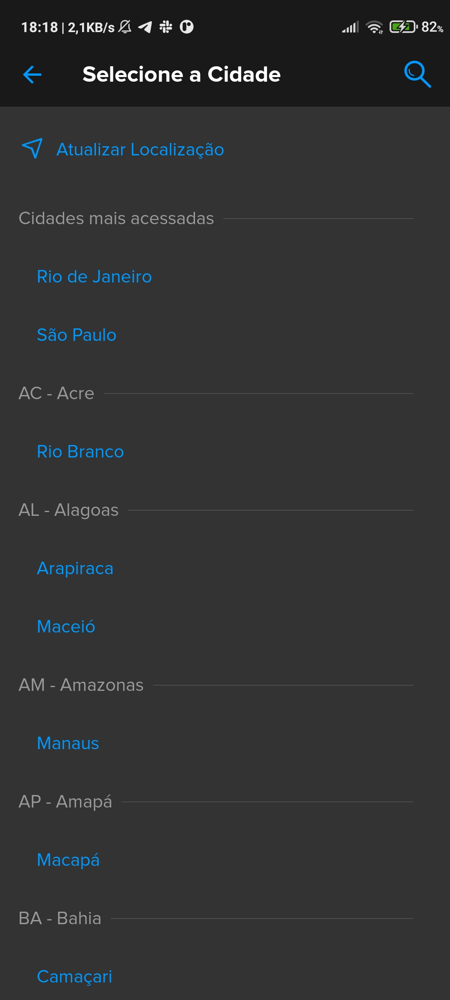

## 3.2 Tela RF02

## 3.3 Tela RF03

## 3.4 Tela RF04

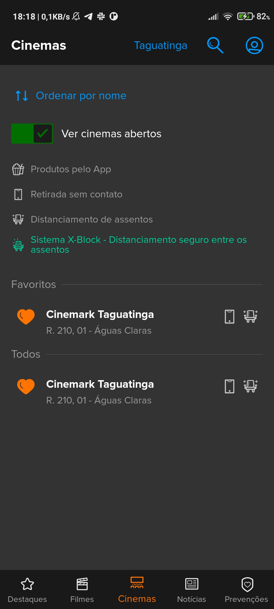

## 3.5 Tela RF05

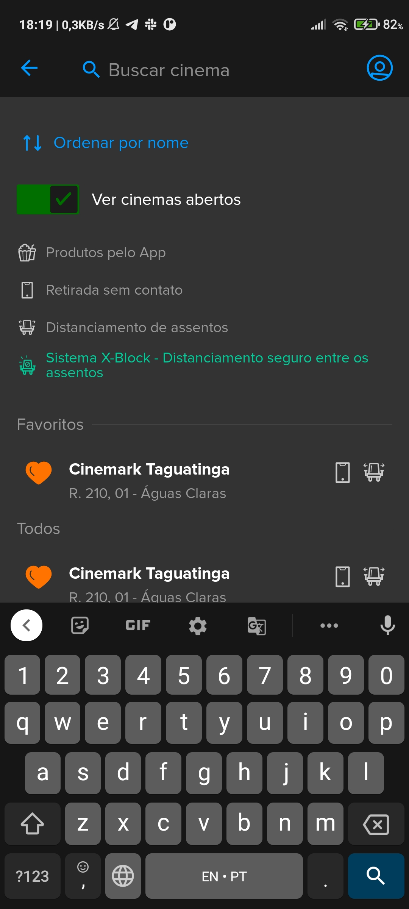

## 3.6 Tela RF06

## 3.7 Tela RF07

## 3.8 Tela RF08

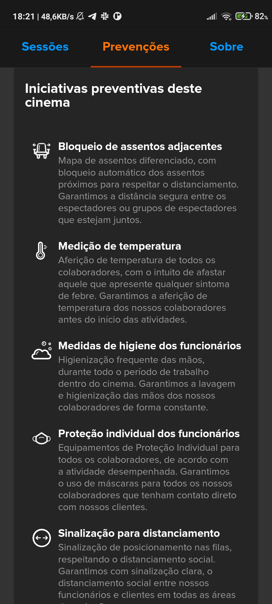

## 3.9 Tela RF09

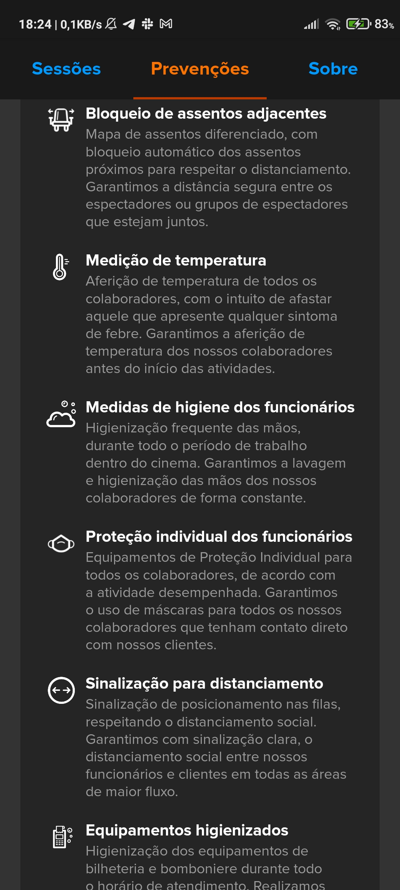

## 3.10 Tela RF10

## 3.11 Tela RF11

## 3.12 Tela RF12

## 3.13 Tela RF13

## 3.14 Tela RF14

## 3.15 Tela RF15

## 3.16 Tela RF16

## 3.17 Tela RF17

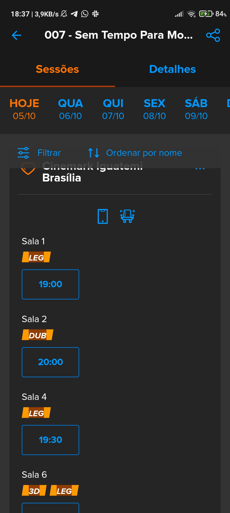

## 3.18 Tela RF18

## 3.19 Tela RF19

## 3.21 Tela RF20

## 3.21 Tela RF21

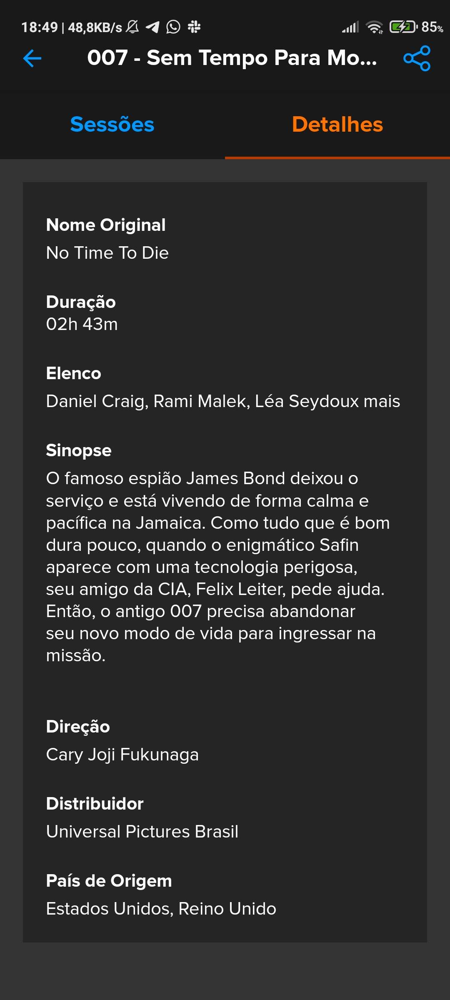

## 3.22 Tela RF22

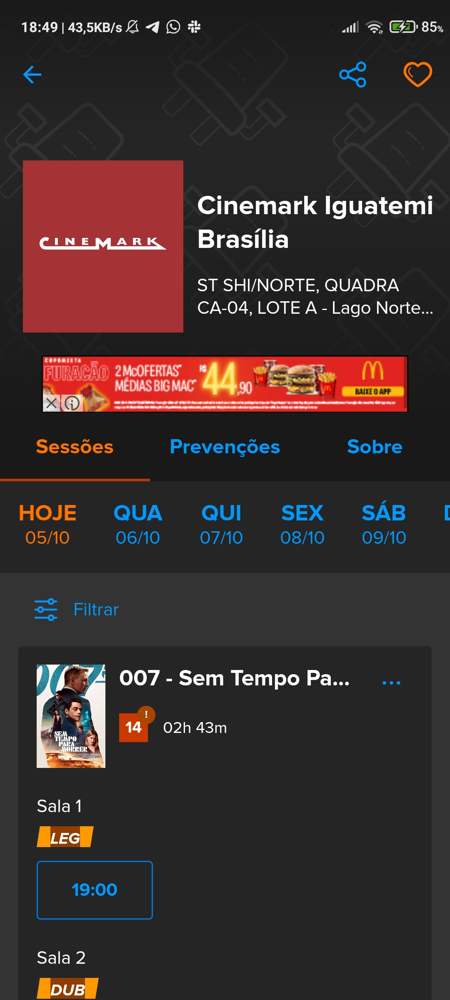

## 3.23 Tela RF25

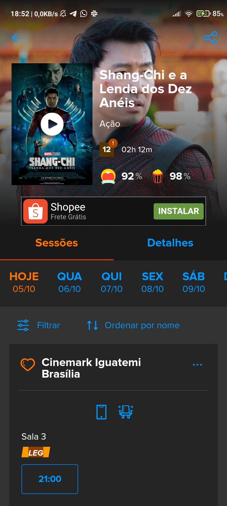

## 3.24 Tela RF26

## 3.25 Tela RF27

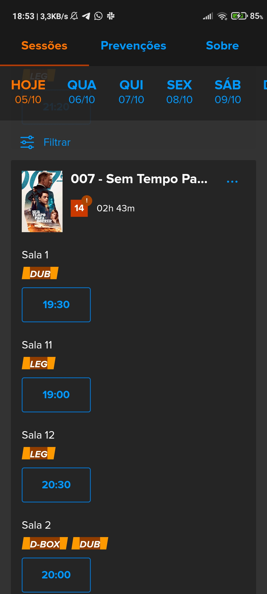

## 3.26 Tela RF28

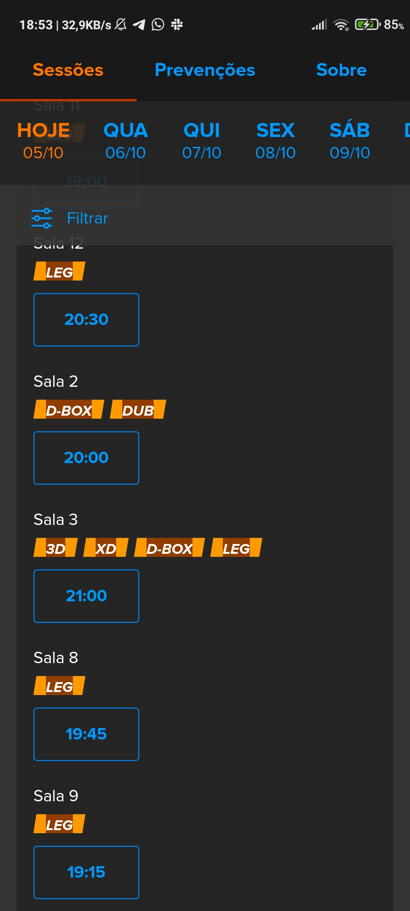

## 3.27 Tela RF29

## 3.28 Tela RF30

## 3.29 Tela RF31

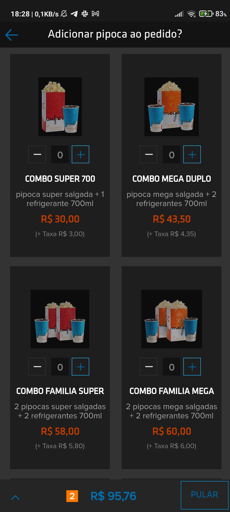

## 3.30 Tela RF32

## 3.31 Tela RF33

## 3.32 Tela RF34

## 3.33 Tela RF35

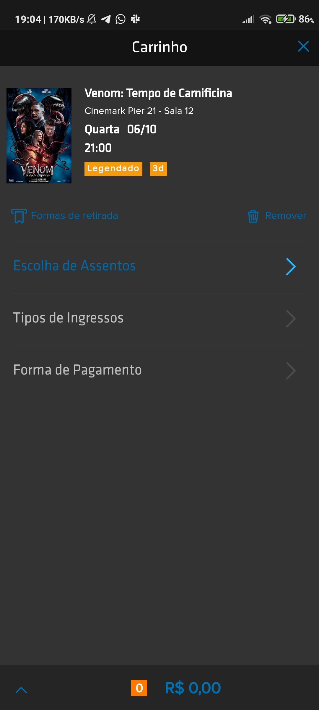

## 3.34 Tela RF36

## 3.35 Tela RF38

## 3.36 Tela RF43

## 3.37 Tela RF44

## 3.38 Tela RF46

## 3.39 Tela RF47

## 3.40 Tela RF48

## 3.41 Tela RF49

## 3.42 Tela RF50

## 3.43 Tela RF51

## 3.44 Tela RF52

## 3.45 Tela RF53

## 3.46 Tela RF54

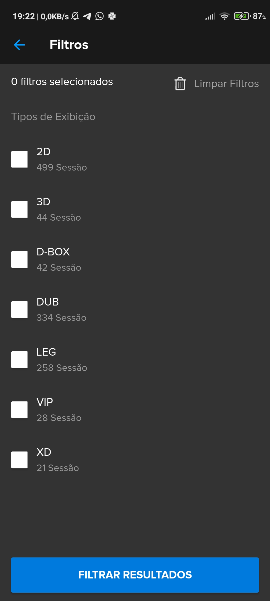

## 3.47 Tela RF55

## 3.48 Tela RF56

## 3.49 Tela RF57

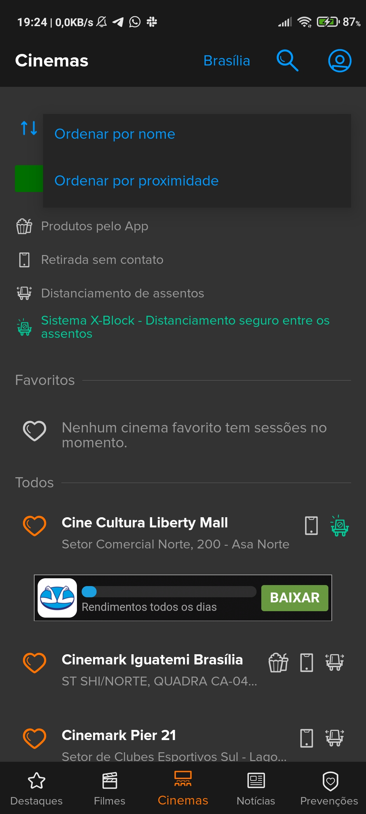

## 3.50 Tela RF58

## 3.51 Tela RF59

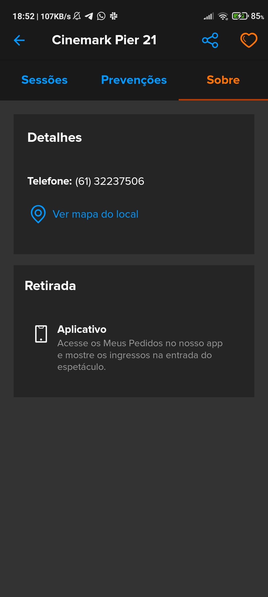

## 3.52 Tela RF60

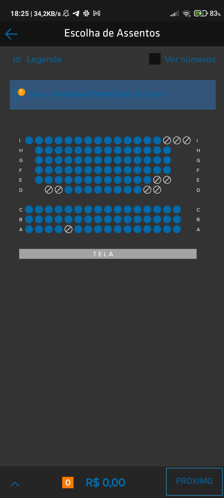

## 3.53 Tela RF61

## 3.54 Tela RF62

## 3.55 Tela RF63

## 3.56 Tela RF64

## 3.57 Tela RF65

## 3.58 Tela RF66

## 3.59 Tela RF68

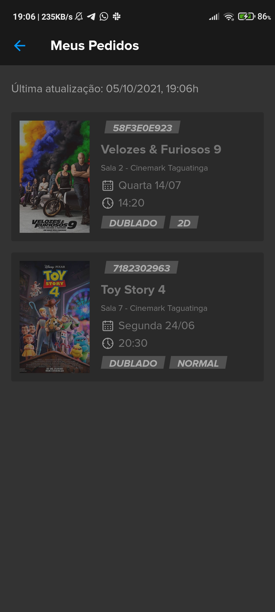

