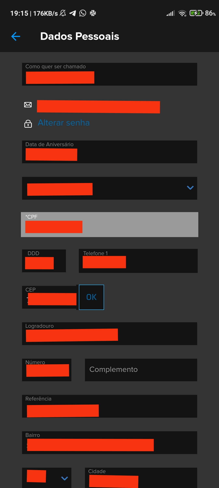

## 1. Versionamento
|Versão|Data|Descrição|Autor(es)|
|------|----|---------|---------|
| 1.0 | 05/10 | Criação do documento e adição das telas | Carlos, Rafael e Thiago |
| 1.1 | 05/10 | Adição das legendas | Thiago |

## 2. Introdução

As telas são capturas de tela de acordo com os requisitos levantados na elicitação.
 

## 3. Resultados

## 3.1 Tela RF01

<h6 align="center">Figura 1: Captura de tela do requisito RF01</h6>
<h6 align="center">Fonte: Autores</h6>

## 3.2 Tela RF02

<h6 align="center">Figura 2: Captura de tela do requisito RF02</h6>
<h6 align="center">Fonte: Autores</h6>

## 3.3 Tela RF03

<h6 align="center">Figura 3: Captura de tela do requisito RF03</h6>
<h6 align="center">Fonte: Autores</h6>

## 3.4 Tela RF04

<h6 align="center">Figura 4: Captura de tela do requisito RF04</h6>
<h6 align="center">Fonte: Autores</h6>

## 3.5 Tela RF05

<h6 align="center">Figura 5: Captura de tela do requisito RF05</h6>
<h6 align="center">Fonte: Autores</h6>

## 3.6 Tela RF06

<h6 align="center">Figura 6: Captura de tela do requisito RF06</h6>
<h6 align="center">Fonte: Autores</h6>

## 3.7 Tela RF07

<h6 align="center">Figura 7: Captura de tela do requisito RF07</h6>
<h6 align="center">Fonte: Autores</h6>

## 3.8 Tela RF08

<h6 align="center">Figura 8: Captura de tela do requisito RF08</h6>
<h6 align="center">Fonte: Autores</h6>

## 3.9 Tela RF09

<h6 align="center">Figura 9: Captura de tela do requisito RF09</h6>
<h6 align="center">Fonte: Autores</h6>

## 3.10 Tela RF10

<h6 align="center">Figura 10: Captura de tela do requisito RF10</h6>
<h6 align="center">Fonte: Autores</h6>

## 3.11 Tela RF11

<h6 align="center">Figura 11: Captura de tela do requisito RF11</h6>
<h6 align="center">Fonte: Autores</h6>

## 3.12 Tela RF12

<h6 align="center">Figura 12: Captura de tela do requisito RF12</h6>
<h6 align="center">Fonte: Autores</h6>

## 3.13 Tela RF13

<h6 align="center">Figura 13: Captura de tela do requisito RF13</h6>
<h6 align="center">Fonte: Autores</h6>

## 3.14 Tela RF14

<h6 align="center">Figura 14: Captura de tela do requisito RF14</h6>
<h6 align="center">Fonte: Autores</h6>

## 3.15 Tela RF15

<h6 align="center">Figura 15: Captura de tela do requisito RF15</h6>
<h6 align="center">Fonte: Autores</h6>

## 3.16 Tela RF16

<h6 align="center">Figura 16: Captura de tela do requisito RF16</h6>
<h6 align="center">Fonte: Autores</h6>

## 3.17 Tela RF17

<h6 align="center">Figura 17: Captura de tela do requisito RF17</h6>
<h6 align="center">Fonte: Autores</h6>

## 3.18 Tela RF18

<h6 align="center">Figura 18: Captura de tela do requisito RF18</h6>
<h6 align="center">Fonte: Autores</h6>

## 3.19 Tela RF19

<h6 align="center">Figura 19: Captura de tela do requisito RF19</h6>
<h6 align="center">Fonte: Autores</h6>

## 3.21 Tela RF20

<h6 align="center">Figura 21: Captura de tela do requisito RF20</h6>
<h6 align="center">Fonte: Autores</h6>

## 3.21 Tela RF21

<h6 align="center">Figura 21: Captura de tela do requisito RF21</h6>
<h6 align="center">Fonte: Autores</h6>

## 3.22 Tela RF22

<h6 align="center">Figura 22: Captura de tela do requisito RF22</h6>
<h6 align="center">Fonte: Autores</h6>

## 3.23 Tela RF25

<h6 align="center">Figura 23: Captura de tela do requisito RF25</h6>
<h6 align="center">Fonte: Autores</h6>

## 3.24 Tela RF26

<h6 align="center">Figura 24: Captura de tela do requisito RF26</h6>
<h6 align="center">Fonte: Autores</h6>

## 3.25 Tela RF27

<h6 align="center">Figura 25: Captura de tela do requisito RF27</h6>
<h6 align="center">Fonte: Autores</h6>

## 3.26 Tela RF28

<h6 align="center">Figura 26: Captura de tela do requisito RF28</h6>
<h6 align="center">Fonte: Autores</h6>

## 3.27 Tela RF29

<h6 align="center">Figura 27: Captura de tela do requisito RF29</h6>
<h6 align="center">Fonte: Autores</h6>

## 3.28 Tela RF30

<h6 align="center">Figura 28: Captura de tela do requisito RF30</h6>
<h6 align="center">Fonte: Autores</h6>

## 3.29 Tela RF31

<h6 align="center">Figura 29: Captura de tela do requisito RF31</h6>
<h6 align="center">Fonte: Autores</h6>

## 3.30 Tela RF32

<h6 align="center">Figura 30: Captura de tela do requisito RF32</h6>
<h6 align="center">Fonte: Autores</h6>

## 3.31 Tela RF33

<h6 align="center">Figura 31: Captura de tela do requisito RF33</h6>
<h6 align="center">Fonte: Autores</h6>

## 3.32 Tela RF34

<h6 align="center">Figura 32: Captura de tela do requisito RF34</h6>
<h6 align="center">Fonte: Autores</h6>

## 3.33 Tela RF35

<h6 align="center">Figura 33: Captura de tela do requisito RF35</h6>
<h6 align="center">Fonte: Autores</h6>

## 3.34 Tela RF36

<h6 align="center">Figura 34: Captura de tela do requisito RF36</h6>
<h6 align="center">Fonte: Autores</h6>

## 3.35 Tela RF38

<h6 align="center">Figura 35: Captura de tela do requisito RF38</h6>
<h6 align="center">Fonte: Autores</h6>

## 3.36 Tela RF43

<h6 align="center">Figura 36: Captura de tela do requisito RF43</h6>
<h6 align="center">Fonte: Autores</h6>

## 3.37 Tela RF44

<h6 align="center">Figura 37: Captura de tela do requisito RF44</h6>
<h6 align="center">Fonte: Autores</h6>

## 3.38 Tela RF46

<h6 align="center">Figura 38: Captura de tela do requisito RF46</h6>
<h6 align="center">Fonte: Autores</h6>

## 3.39 Tela RF47

<h6 align="center">Figura 39: Captura de tela do requisito RF47</h6>
<h6 align="center">Fonte: Autores</h6>

## 3.40 Tela RF48

<h6 align="center">Figura 40: Captura de tela do requisito RF48</h6>
<h6 align="center">Fonte: Autores</h6>

## 3.41 Tela RF49

<h6 align="center">Figura 41: Captura de tela do requisito RF49</h6>
<h6 align="center">Fonte: Autores</h6>

## 3.42 Tela RF50

<h6 align="center">Figura 42: Captura de tela do requisito RF50</h6>
<h6 align="center">Fonte: Autores</h6>

## 3.43 Tela RF51

<h6 align="center">Figura 43: Captura de tela do requisito RF51</h6>
<h6 align="center">Fonte: Autores</h6>

## 3.44 Tela RF52

<h6 align="center">Figura 44: Captura de tela do requisito RF52</h6>
<h6 align="center">Fonte: Autores</h6>

## 3.45 Tela RF53

<h6 align="center">Figura 45: Captura de tela do requisito RF53</h6>
<h6 align="center">Fonte: Autores</h6>

## 3.46 Tela RF54

<h6 align="center">Figura 46: Captura de tela do requisito RF54</h6>
<h6 align="center">Fonte: Autores</h6>

## 3.47 Tela RF55

<h6 align="center">Figura 47: Captura de tela do requisito RF55</h6>
<h6 align="center">Fonte: Autores</h6>

## 3.48 Tela RF56

<h6 align="center">Figura 48: Captura de tela do requisito RF56</h6>
<h6 align="center">Fonte: Autores</h6>

## 3.49 Tela RF57

<h6 align="center">Figura 49: Captura de tela do requisito RF57</h6>
<h6 align="center">Fonte: Autores</h6>

## 3.50 Tela RF58

<h6 align="center">Figura 50: Captura de tela do requisito RF58</h6>
<h6 align="center">Fonte: Autores</h6>

## 3.51 Tela RF59

<h6 align="center">Figura 51: Captura de tela do requisito RF59</h6>
<h6 align="center">Fonte: Autores</h6>

## 3.52 Tela RF60

<h6 align="center">Figura 52: Captura de tela do requisito RF60</h6>
<h6 align="center">Fonte: Autores</h6>

## 3.53 Tela RF61

<h6 align="center">Figura 53: Captura de tela do requisito RF61</h6>
<h6 align="center">Fonte: Autores</h6>

## 3.54 Tela RF62

<h6 align="center">Figura 54: Captura de tela do requisito RF62</h6>
<h6 align="center">Fonte: Autores</h6>

## 3.55 Tela RF63

<h6 align="center">Figura 55: Captura de tela do requisito RF63</h6>
<h6 align="center">Fonte: Autores</h6>

## 3.56 Tela RF64

<h6 align="center">Figura 56: Captura de tela do requisito RF64</h6>
<h6 align="center">Fonte: Autores</h6>

## 3.57 Tela RF65

<h6 align="center">Figura 57: Captura de tela do requisito RF65</h6>
<h6 align="center">Fonte: Autores</h6>

## 3.58 Tela RF66

<h6 align="center">Figura 58: Captura de tela do requisito RF66</h6>
<h6 align="center">Fonte: Autores</h6>

## 3.59 Tela RF68

<h6 align="center">Figura 59: Captura de tela do requisito RF68</h6>
<h6 align="center">Fonte: Autores</h6>

