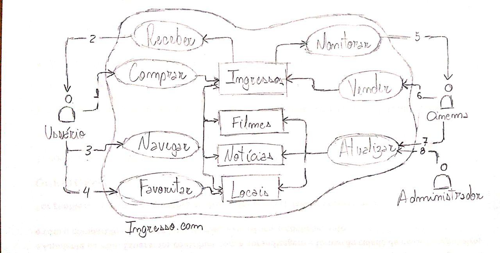
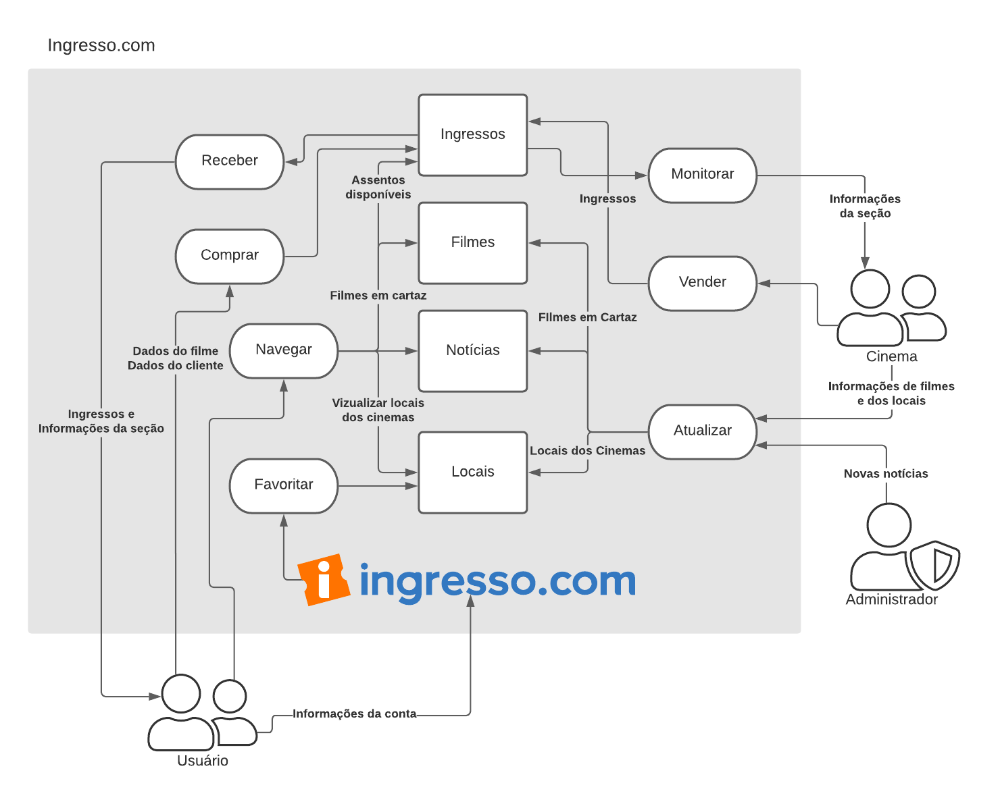

# 1. Versionamento
|Versão|Data|Descrição|Autor(es)|
|------|----|---------|---------|
|1.0|29/07|Adição da primeira versão da Rich Picture|João e Victor|
|1.1|30/07|Adição da segunda versão da Rich Picture|João e Victor|

# 2. Introdução

 Rich pictures são ferramentas efetivas para a análise de problemas e como forma de expressão de ideias. Com isso, uma rich picture deve ser capaz de contar uma história através de imagens, fotos e rótulos descritivos nos dando uma ideia do que está acontecendo [1].

# 3. Rich Pictures
## 3.1 Versão 1.0

<h6 align = "center">Fonte: Autor</h6>

## 3.2 Versão 2.0

<h6 align = "center">Fonte: Autor</h6>

# 4. Referências

[1] Elsanna, C. R. Software Development. <b>Project Rich Picture Guidelines</b>. [20-?]

