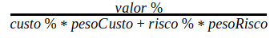

## 1. Versionamento

|Versão|Data|Descrição|Autor(es)|
|------|----|---------|---------|
|1.0|19/08|Abertura do documento|Carlos e Thiago|
|1.1|19/08|Adição da Priorização|Carlos e Thiago|

## 2. Introdução

Há uma necessidade para uma priorização de requisitos mais rigorosa e analítica [1]. A First Things First é uma técnica que ajuda a relacionar as funcionalidades com um valor estimado que o representante dos clientes e o representante da equipe de desenvolvimento entrega para elas. Assim, [1] apresenta os passos necessários para a realização dessa técnica, e esse procedimento é mostrado abaixo: 

- Liste em uma tabela todos os requisitos que serão priorizados.
- Estime o benefício relativo que cada requisito fornece ao cliente em uma escala de 1 a 9.
- Estime a penalidade relativa que o cliente sofreria caso a funcionalidade não fosse incluida em uma escala de 1 a 9.
- Adicione uma coluna que será a soma do benefício multiplicado pelo peso e da penalidade multiplicada para cada requisito.
- Estime o custo de implementação de cada funcionalidade em uma escala de 1 a 9.
- Estime o risco da funcionalidade não ser entregue na primeira tentativa em uma escala de 1 a 9.
- Use a seguinte fórmula para calcular a prioridade de cada requisito:

    

- Finalmente, ordene a lista de requisitos em ordem decrescente da prioridade calculada.

Além dos passos apresentados, levamos em consideração alguns pontos apresentados por [1] para estimarmos a priorização, sendo eles: 

- A necessidade do cliente.
- A importância relativa dos requisitos para os clientes.
- O tempo que cada funcionalidade deve ser entregue.
- Requisitos que são predecessores de outros requisitos.
- O custo para satisfazer cada requisito.

## 3. Priorização

|Códigos das Funcionalidades|Benefício Relativo|Penalidade relativa|Valor Total|Valor %|Custo Relativo|Custo %|Risco Relativo|Risco %|Prioridade|
|:-:|:-:|:-:|:-:|:-:|:-:|:-:|:-:|:-:|:-:|
|AP15|9|7|25|4.440|4|1.961|4|2.367|1.412|
|AP14|8|6|22|3.908|3|1.471|5|2.959|1.325|
|I32|8|2|18|3.197|2|0.980|5|2.959|1.300|
|E01|9|9|27|4.796|7|3.431|2|1.183|1.192|
|AP11|7|8|22|3.908|5|2.451|3|1.775|1.170|
|I16|7|2|16|2.842|2|0.980|5|2.959|1.155|
|E03|7|8|22|3.908|5|2.451|4|2.367|1.075|
|OP07|6|1|13|2.309|2|0.980|4|2.367|1.067|
|I02|4|2|10|1.776|1|0.490|4|2.367|1.061|
|AP01|6|6|18|3.197|4|1.961|4|2.367|1.017|
|BS11|8|6|22|3.908|5|2.451|5|2.959|0.994|
|I26|7|3|17|3.020|5|2.451|2|1.183|0.992|
|I33|7|4|18|3.197|5|2.451|4|2.367|0.880|
|OP08|5|1|11|1.954|4|1.961|1|0.592|0.866|
|OP06|8|2|18|3.197|5|2.451|5|2.959|0.813|
|OP43|5|4|14|2.487|4|1.961|4|2.367|0.791|
|I25|7|3|17|3.020|6|2.941|3|1.775|0.789|
|I24|6|3|15|2.664|4|1.961|5|2.959|0.774|
|I29|6|2|14|2.487|3|1.471|6|3.550|0.766|
|OP04|8|3|19|3.375|8|3.922|2|1.183|0.748|
|AP13|7|4|18|3.197|6|2.941|6|3.550|0.678|
|BS16|4|2|10|1.776|5|2.451|1|0.592|0.647|
|I34|3|2|8|1.421|4|1.961|1|0.592|0.630|
|OP26|4|1|9|1.599|2|0.980|6|3.550|0.580|
|I10|6|2|14|2.487|7|3.431|3|1.775|0.576|
|BS12|4|3|11|1.954|6|2.941|2|1.183|0.553|
|I31|4|1|9|1.599|5|2.451|2|1.183|0.525|
|AP04|4|4|12|2.131|4|1.961|8|4.734|0.493|
|OP12|3|2|8|1.421|3|1.471|5|2.959|0.482|
|I15|3|3|9|1.599|5|2.451|3|1.775|0.479|
|I04|6|2|14|2.487|8|3.922|5|2.959|0.460|
|OP09|4|1|9|1.599|6|2.941|2|1.183|0.452|
|AP06|4|2|10|1.776|6|2.941|5|2.959|0.402|
|AP05|3|4|10|1.776|5|2.451|7|4.142|0.393|
|AP10|3|2|8|1.421|5|2.451|4|2.367|0.391|
|OP42|3|2|8|1.421|5|2.451|5|2.959|0.362|
|AP07|1|1|3|0.533|2|0.980|2|1.183|0.339|
|I05|2|1|5|0.888|2|0.980|6|3.550|0.322|
|AP02|2|1|5|0.888|3|1.471|5|2.959|0.301|
|I14|3|3|9|1.599|8|3.922|5|2.959|0.296|
|AP08|2|2|6|1.066|7|3.431|1|0.592|0.286|
|OP03|2|1|5|0.888|7|3.431|3|1.775|0.206|
|I13|2|1|5|0.888|9|4.412|5|2.959|0.151|
|Totais|217|129|563|100|204|100|169|100|30.191|
|Peso Relativo|2|1|||1||0.5|

<h6 align = "center">Tabela 1: Tabela contendo a priorização First Things First.</h6>
<h6 align = "center">Fonte: Autores</h6>

### 2.1 Requisitos de Referência

|Código|Códigos das Funcionalidades|Tipo de Requisito|
|:-:|:-:|:-:|
|AP15|O aplicativo deve identificar o usuário no pagamento|Requisito Funcional|
|AP14|O usuário deve conseguir efetuar o pagamento de diferentes formas|Requisito Funcional|
|I32|Apresentar informações do ingresso|Requisito Funcional|
|E01|O usuário deve ser capaz de comprar tickets para o filme|Requisito Funcional|
|AP11|O usuário deve poder escolher o(s) seu(s) assento(s)|Requisito Funcional|
|I16|Apresentar as informações do cinema|Requisito Funcional|
|E03|O usuário deve ser capaz de ver os horários dos filmes|Requisito Funcional|
|OP07|O usuário deve poder ver seus Pedidos|Requisito Funcional|
|I02|Apresentar os filmes que serão lançados|Requisito Funcional|
|AP01|O aplicativo deve permitir selecionar a região desejada|Requisito Funcional|
|BS11|O aplicativo deve permitir o cancelamento/reembolso da compra|Requisito Funcional|
|I26|Mostrar o total e informações do pagamento|Requisito Funcional|
|I33|Enviar o ingresso por e-mail|Requisito Funcional|
|OP08|O usuário deve poder ver seus Cartões Salvos|Requisito Funcional|
|OP06|O usuário deve poder ver seus dados pessoais|Requisito Funcional|
|OP43|O usuário deve poder poder ver carrinho com as sessões selecionadas|Requisito Funcional|
|I25|Mostrar um resumo da compra|Requisito Funcional|
|I24|Comprar sem o cadastro|Requisito Funcional|
|I29|O resumo do pedido deve ser enviado por e-mail|Requisito Funcional|
|OP04|O usuário deve poder recuperar senha|Requisito Funcional|
|AP13|O usuário deve poder escolher o alimento(combo) que irá consumir na sessão|Requisito Funcional|
|BS16|O aplicativo deve fornecer informações sobre eventos próximos a região escolhida|Requisito Funcional|
|I34|Notificar quando a sessão tiver chegando|Requisito Funcional|
|OP26|O usuário deve poder assistir trailer do filme|Requisito Funcional|
|I10|Apresentar informações sobre o filme|Requisito Funcional|
|BS12|O aplicativo deve informar o histórico de compra dos usuários logados|Requisito Funcional|
|I31|Notificar a confirmação do pagamento|Requisito Funcional|
|AP04|O usuário deve conseguir ver os cinemas na região desejada|Requisito Funcional|
|OP12|O usuário deve poder enviar uma solicitação de atendimento|Requisito Funcional|
|I15|Compartilhar o filme|Requisito Funcional|
|I04|Pesquisar um filme|Requisito Funcional|
|OP09|O usuário deve poder sair da conta logada|Requisito Funcional|
|AP06|O aplicativo deve recomendar os filmes em alta (destaques)|Requisito Funcional|
|AP05|O usuário deve conseguir pesquisar os cinemas na região desejada|Requisito Funcional|
|AP10|O usuário deve se cadastrar utilizando redes sociais ou não|Requisito Funcional|
|OP42|O usuário deve poder aplicar código de desconto no pagamento|Requisito Funcional|
|AP07|O aplicativo deve recomendar notícias em alta (destaques)|Requisito Funcional|
|I05|Ter uma área para notícias|Requisito Funcional|
|AP02|O usuário deve conseguir ver os filmes em cartaz na região desejada|Requisito Funcional|
|I14|Recomendar outros filmes|Requisito Funcional|
|AP08|O aplicativo deve exibir as prevenções adotadas pelos cinemas referentes a pandemia do covid-19|Requisito Funcional|
|OP03|O usuário deve poder visualizar senha digitada|Requisito Funcional|
|I13|Ter como seguir o filme para acompanhar notícias e lançamentos|Requisito Funcional|

<h6 align = "center">Tabela 2: Tabela contendo a legenda da priorização First Things First.</h6>
<h6 align = "center">Fonte: Autores</h6>

## 3. Referências

[[1] Wiegers, K.; Beatty, J. Software Requirements. <b>Microsoft Press</b>. ed. 3, 2013.

